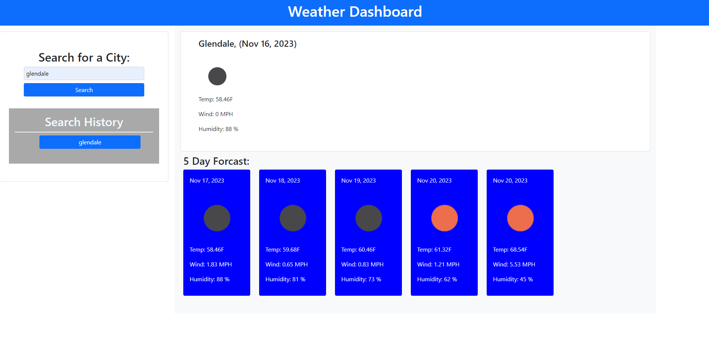

# weather-dashboard

[Visit the Deployed Site](https://azurek17.github.io/weather-dashboard/)

### Technoloy used:
* Day.js - https://day.js.org/
* Current Weather Data -https://openweathermap.org/current
* 5 Day / 3 Hour Forecast -https://openweathermap.org/forecast5
* Geocoding API - https://openweathermap.org/api/geocoding-api

## Description

A weather Dashboard which displays a city's current weather and a 5 day forcast.

## Usage
When you go to the website, you will be asked to enter a city name. In result, the current day and a 5 day forcast of the weather will display.

Below are a few examples of code:
 -------------------------------
 Geocoding API:

    function requestCoord(cityInput){
    var cityCoords = `http://api.openweathermap.org/geo/1.0/direct?q=${cityInput},&limit=1&appid=${apiKey}`
    
    fetch(cityCoords)
    .then(function (response) {
            console.log("fetchCords", response);
            return response.json();
    })
        .then(function (fetchedCoords){
        console.log("Fetched Coords", fetchedCoords);
        })
    }

-------------------------------

Current Weather Data:

    function requestWeather(latCity, lonCity) {
    var cityWeather = `https://api.openweathermap.org/data/2.5/weather?lat=${latCity},&lon=${lonCity},&units=imperial&appid=${apiKey}`

    fetch(cityWeather)
    .then(function (response){
        console.log("fecthWeather", response);
        return response.json();
        
    })
    .then(function (fecthedWeather){
        console.log("Fetched Today's Weather", fecthedWeather);
        console.log("-------------");  // log not needed
       
            console.log("date", fecthedWeather.dt);//
            console.log("icon", fecthedWeather.weather[0].icon);
            console.log("temp", fecthedWeather.main.temp);
            console.log("wind", fecthedWeather.wind.speed);
            console.log("humidity", fecthedWeather.main.humidity);
    })
}

## Credits
* AskBCS Learning Assistant
* Tutoring Session
* StudyGroup
* Google Search